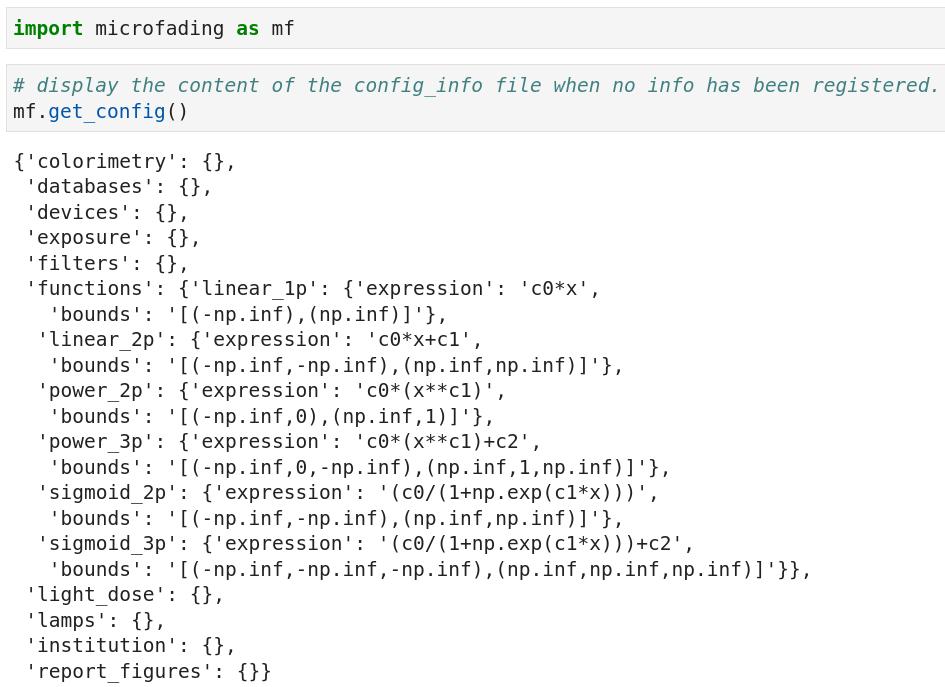

The `microfading` package uses two distinct ways to store information about the anything related to the measurements. On the one side there is **configuration info** and on the other side **databases info**. In this section, you will learn about the two types of info, see how they differ one from another and how to adequately use them.

&nbsp;

## 1. **Configuration info**


The configuration info consists of information related to the use of the `microfading` package which are stored inside a json file called *config_info*. The configuration info are meant to facilitate the use of the `microfading` package. For example, if you always want the colorimetric coordinates ($L^*a^*b^*$) to be calculated with a 10 degrees observer and a D65 illuminant, then you can register these info, so that every time the colorimetric coordinates are being computed, requested, or plotted, it will by default use a 10 degrees observer and a D65 illuminant.

To obtain the location of the file on your compute, use the `get_config_path` method as described below.

```python
import microfading as mf

# It returns the location of the config_info file.
mf.get_config_path()
```

<div class="output-area">
<pre>
PosixPath('/home/john/anaconda3/lib/python3.11/site-packages/microfading/config_info.json')
</pre>
</div>

To access the contain of the config_info file, use the `get_config` method as illustrated in the figure below.

{: .img-large align=left }
/// caption
Retrieve the content of the config_info file.
///

To learn how to the set the content of the *config_info* file, consult the page on the [configuration info](https://g-patin.github.io/microfading/configuration-info/) in the tutorial section.


## 2. **Databases info**

The databases info consist of information regarding the investigated objects and the analytical devices. This type of info is meant to grow the more you perform analyses and will help you to perform queries on the microfading data. For example, as you perform analyses, you can register the name of the artist related to the objects, so that afterwards, you have the possibility to ask for all the microfading analyses that were performed on objects made by a given artist. 

The database info is implemented by another python package called [`msdb`](https://github.com/g-patin/msdb) (material science database) which is being used inside the `microfading` package. The idea is that these info can be useful for several analytical techniques and should therefore be easily accessible by different programs, users, etc. The database info is stored inside several txt and csv files. For more information about the msdb package, you can consult the [documentation website](https://g-patin.github.io/msdb/) of the `msdb` package.

To learn more about the use of database info within the `microfading` package, consult the [database management](https://g-patin.github.io/microfading/databases-management/) page in the tutorial section


---

© 2025 Gauthier Patin. All rights reserved. | Last updated: 2025-05-24

