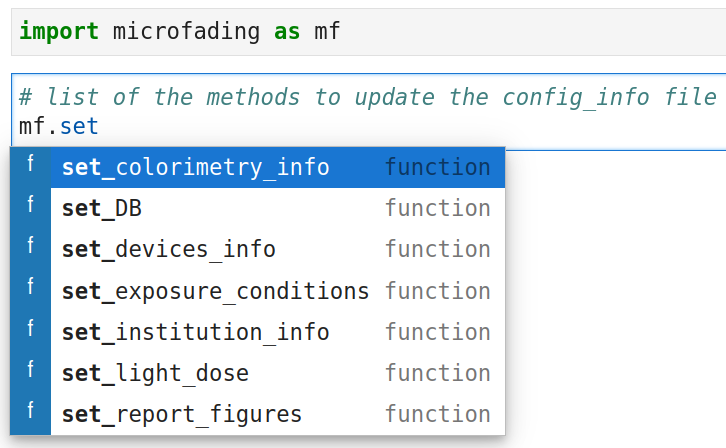
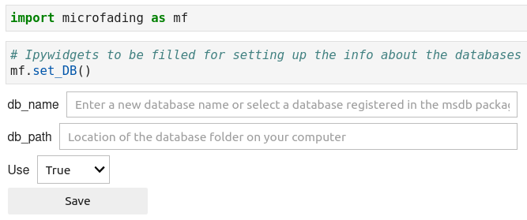
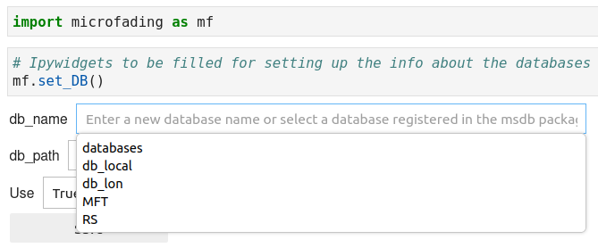
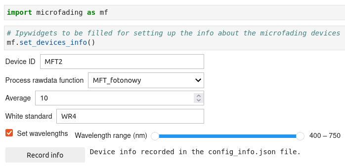

This section deals with the config_info.json file of the `microfading` package and shows you how to adequately use it. 

## 1. **Configuration info**

The config_info file contains dictionaries about different aspects of the `microfading package` (See Table 1, dictionary keys). To access the contain of the config_info file, use the `get_config` method as illustrated in the figure below.

{: .img-large align=left }
/// caption
Retrieve the content of the config_info file.
///

Table 1. Description of the dictionary keys.

| 
Dictionary keys
 | 
Description

| :--------| :---------
|colorimetry| Information about colorimetric coordinates (observer and illuminant)
|databases | Information about the databases (see [db management](https://g-patin.github.io/microfading/databases-management/))
|devices | Information about the microfading devices 
|exposure | Information about the exposure conditions in museums
|filters | Information about optical filters used in microfading systems
|functions |Mathematical functions used to fit data
|lamps | Information about lamps used in microfading systems
|light_dose | Information the unit of light dose energy
|institution| Information about the institution using the microfading devices
|report_figures | Information about the figures displayed in microfading reports

For each key, information can be stored and used by some of the methods available in the `microfading` package. For exemple, the key *institution* enables you to store information about your institution (name, acronym, address, etc.), so that these info can automatically be added in reports or in microfading files as metadata. 

**IMPORTANT !!**
Whenever you upgrade the `microfading` package, the *config_info* is reset to its initial state, i.e. empty dictionaries except for the 'functions' dictionary. This means that you will need to refill the config_info file as it was before the upgrade.

## 2. **Content update**

To add or update the information stored inside the config_info.json file, you will need to use the methods that start with the keyword `set` (See figure below and Table 2). The functions return ipywdigets inside which you will be able to add the requested information. An example is given below for the `set_DB` function.

{: .img-medium align=left }
/// caption
List of the methods to update the content of the config_info.json file
///

Table 2. Description of the 'set' methods.

| 
Function names
 | 
Description

| :--------| :---------
|set_colorimetry_info | Set the observer and illuminant values
|set_DB | Set the databases info enabling a connection between the `msdb` package and the `microfading` package
|set_devices_info | Set the info about the microfading devices
|set_exposure_conditions | Set information about the exposure conditions in museums
|set_light_dose | Set the preferred unit of light dose energy values
|set_institution_info | Set information about the institution using the microfading devices
|set_report_figures | Set aesthetic choice about the figures displayed in microfading reports

### set_DB

The `set_DB` function enables you to connect the `microfading` package with databases files created by the `msdb` package. As a pre-requesite, you will need to have created databases files on your local computer ([create_DB](https://g-patin.github.io/microfading/create-databases/)). You can check the databases that you created by looking at the [config file](https://g-patin.github.io/msdb/get_config/) of the msdb package. 

{: .img-medium align=left }
/// caption
Information about the databases
///

In the *db_name* widget, the names of the existing databases should appear when click on the `Tab` button. In the example below, we can see that I created 5 differents databases. One of them is called 'MFT' and this is the one I will choose for the microfading package. Its then automatically fills in the *db_path* widget.

{: .img-medium align=left }
/// caption
Information about the databases
///

Once the `microfading` package has access to the databases files, it will fetch the information contained in these files and use them in some of the methods of the `MFT` class. 

### set_devices_info

The `set_devices_info` function allows you to configure some of the parameters of microfading devices. See the figure below for an example. I have a Fotonowy microfading device with 'MFT2' as device ID number (I don't except to have more than 10 microfading devices over the next 1oo years). I selected the 'MFT_fotonowy' processs function, an average of 10 which is what I normally use when doing analyses and 'WR4' is the ID number of my Fotolon standard, which I previously registered with the help of the msdb package. Ultimately, when I need to process microfading raw files, I just have to indicate to the python function ([`process_rawdata`](https://g-patin.github.io/microfading/rawdata-processing/)) that the measurements were made with the 'MFT2' so that the program can select the right process function, add the info about the white standard, and only keep the reflectance values between 400 and 750 nm (just noise outside this wavelength range).

{: .img-large align=left }
/// caption
Information about the microfading devices
///

---

© 2025 Gauthier Patin. All rights reserved. | Last updated: 2025-05-24

