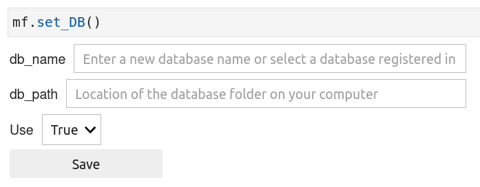
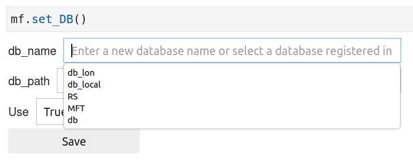
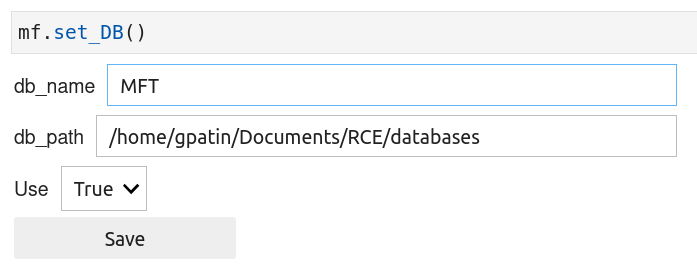

In this section, you will learn how to connect the `microfading` package with the database files, that you created using the `msdb` package (see msdb - [create db files](https://g-patin.github.io/msdb/create-databases/)).

Follow the instructions below:

1. open a new or an existing notebook

2. import the microfading package

	```python
	import microfading as mf
	```

3. In a new cell, run the following code:

	```python
	mf.set_DB()
	```
		
	This will display some ipywidgets (see figures below). If you click on inside the white space rectangle for the *db_name* and then push the bottom arrow on your keyboard, a window should appear with the name of the database files that you previously created. You can then select one of the names, and the *db_path* will automatically be filled with the valid value.


{: .img-large align=left }
/// caption
ipywidgets to connect with the database files.
///


{: .img-large align=left }
/// caption
ipywidgets to connect with the database files - select a db_name.
///


{: .img-large align=left }
/// caption
ipywidgets to connect with the database files - all is completed, click on the Save button.
///

The parameter called *Use* defines whether the `microfading` package should by default make us the information provided in the database files. By default it is set to True, and you can leave it as it is. But you can decide to still make the connection between the `microfading` package and the database files and decide manually each time you want the functions of the `microfading` package to make use the database files.

---

© 2026 Gauthier Patin. All rights reserved. | Last updated: 2026-01-18
