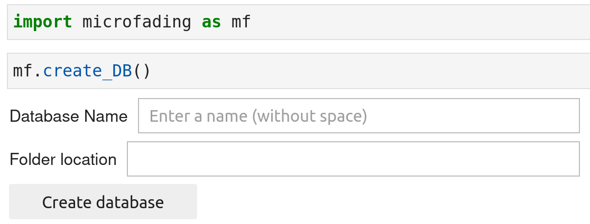

In this section, you will learn how to create the databases files. 

Creating databases is an operation that only needs to be performed one time using the `create_DB()` function. Inside a given folder on your local computer, the algorithm will create a few empty files (csv and txt) in which information about microfading projects and objects can be recorded.

When running the function, it will display some ipywidgets inside which you can enter the name of your database and the local folder where the database files will be stored (see image below). I personally only have a single set of database files for all my microfading analyses (with "MFT" for the database name). This is easier to manage and to query information about obejcts and projects. But you might feel the need to create several sets of database files. 

{: .img-large align=left } 
/// caption
Create database files 
///

&nbsp;

## **Databases created ?**

If you want to know whether databases were created, use the `is_DB()` function.

```python
import microfading as mf

# Return True if databases files were created otherwise False
mf.is_DB()

```
<div class="output-area">
<pre>
True
All the databases were created and can be found in the following directory: /home/john/Documents/MFT/databases
</pre>
</div>

&nbsp;

## **Databases location ?**

If you want to know where are the databases files located, use the  `get_config()` function. It will return the information related to databases.

```python
import microfading as mf

# Return the all the information related to databases included the path_folder
mf.get_config(key='databases')
```


<div class="output-area">
<pre>
{'db_name': 'MFT',
 'path_folder': '/home/john/Documents/RCE/databases',
 'usage': True}
</pre>
</div>

---

© 2026 Gauthier Patin. All rights reserved. | Last updated: 2026-01-17

