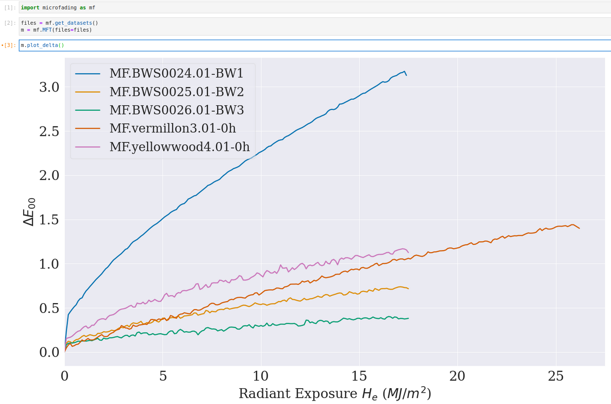

In this section, we will show you how to create visualizations of your microfading data. A summary of this page has been compiled inside a Jupyter notebook and is available for download: [Download notebook](notebooks/Data_visualization.zip)

The plot functions, accessible after creating an instance of the microfading class, start with the verb "plot", as illustrated below. The plot functions are briefly described in Table 1. 

{: .img-medium align=left }
/// caption
The plot functions
///


Table 1. Description of the *plot* functions.

| <div style="width:205px">Function name</div> | <div style="width:250px">Description</div>
| :--------| :---------
|`plot_bars()` | plot the value of a single colorimetric coordinates at a given light dose
|`plot_coordinates()` | plot the CIE colorimetric coordinates as a function of the light energy
|`plot_CIELAB()`  | plot the trajectory of the $L^*a^*b^*$ coordinates in the CIELAB colour space
|`plot_delta()`  | plot the $\Delta$ curves for one or several CIE colour coordinates
|`plot_sp()` | plot the reflectance spectra
|`plot_sp_delta()` | plot the difference between two reflectance spectra
|`plot_swatches_circle()` | plot the colour changes as a series of coloured circles
|`plot_swatches_rectangle()` | plot the colour changes as two coloured rectangles next to each other
|`plots()` | 

## **Basic plotting**

Each plot function has been written so that you can use them without passing any arguments, as illustrated below. Such a visualization will render the default behaviour of each function. The following section shows how to pass arguments to the function to adjust some aspects of the plots.

{: .img-Large align=left }
/// caption
Basic plot.
///

## **Advanced plotting**

To modify the aspects of the plots, you will need to enter the information, as **key : value**, inside dictionaries. There are five dictionaries that encompass all aspects of plotting:

1. *data_settings* : aspects directly related to the data
2. *figure_settings* : aspects about the  figure 
3. *legend_settings* : aspects about the legend
4. *lines_settings* : aspects about the data lines
5. *text_settings* : add a text box inside the figure

As an illustration, the following lines of code show you how to modify the size of a figure:

```python
m = mf.MFT(files=files)
m.plot_delta(figure_settings={'figsize':(15,10)})
```

Though the same dictionaries are used across all the plot functions, the valid keys for each dictionary can differ from one function to another. Table 2 lists all the valid keys according to each plot function. For a thorough description of each key and their corresponding values, see the paragraphs below.

Table 2. Valid keys for each function.

| <div style="width:100px">Plot functions</div> | <div style="width:100px">Parameters</div> | <div style="width:300px">Valid keys</div>
| :--------| :--------- | :---------
|plot_CIELAB | data_settings <br /> figure_settings  <br /> legend_settings <br /> lines_settings | dose_unit, dose_values, derivation, smoothing |
|plot_coordinates | data_settings <br /> figure_settings  <br /> legend_settings <br /> lines_settings | dose_unit, dose_values, derivation, smoothing |
|plot_delta | data_settings <br /> figure_settings  <br /> legend_settings <br /> lines_settings <br />  text_settings | dose_unit, dose_values, derivation, smoothing <br /> figsize, title, xlabel, ylabel, xlim, ylim, fontsize, fontsize_title <br /> fontsize, labels, ncols, position, title <br /> colors, ls, lw <br /> text, xy, fontsize |
|plot_sp | data_settings <br /> figure_settings  <br /> legend_settings <br /> lines_settings <br />  text_settings |  mode, derivation, dose_unit, smoothing, wl_range <br /> figsize, title, xlabel, ylabel, xlim, ylim, fontsize, fontsize_title <br /> fontsize, labels, ncols, position, title <br /> colors, ls, lw <br /> text, xy, fontsize |


### data_settings:

The *data_settings* dictionary encompasses parameters related to the microfading data, for which the following keys can be used:

- **dose_unit** [str], by default 'He'
		
	This key defines the unit of the light dose energy. Any of the following units can be used as a value: 'He', 'Hv', 't'. 
	
	'He' corresponds to radiant energy (MJ/m2)
	
	'Hv' corresponds to exposure dose (Mlxh) 
	
	't' corresponds to times (sec)
	
	e.g. : m.plot_delta(data_settings={'dose_unit':'He'})
	
- **dose_values** [int, float, list, tuple]
	
	This key defines the dose values for which the colourimetric values will be returned. A single dose value (an integer or a float number) can be entered. A list of dose values, as integer or float, can also be entered. A tuple of three values (min, max, step) will be used in a numpy.arange() function to return an array of dose values. 
	
- **derivation** [bool], by default False
	
	This key defines whether to compute the first derivative values. When True, it will plot the derivative values of the colourimetric delta values.
	
- **mode** [str], by default 'R'
	
	It defines the type or mode of the measurement (absorbance or refectance). When 'R', it returns reflectance spectra. When 'A', it returns absorption spectra using the following equation: A = -log(R).


- **smoothing** [tuple of 2 integers], by default (1,0)
	
	This key defines whether the data should be smoothed. It takes a tuple of two integers as value which is used as input for the Savitzky-Golay filter. The first value corresponds to the window_length and the second to the polyorder value. The first value should always be greater than the second value.
	
- **wl_range** [tuple of 2 integers], by default None

	It defines the wavelength range with a two-values integer tuple corresponding to the lowest and highest wavelength values. When None, it plot all the available wavelengths.


 
### figure_settings: 

The *figure_settings* concerns all aspects related to the figure, for which the following keys can be used:

- **figsize** [tuple], by default (15,9)

	It defines the size of the figure.

- **fontsize** [int], by default 18

	It defines the fontsize of the axes labels and ticks.

- **fontsize_title** [int], by default 20

	It defines the fontsize of the title if any.
	
- **title** [str], by default None

	Whether to display a title.
	
- **xlabel** [str]

	Label of the x-axis. The default value varies according to the plot function.
	
- **xlim** [tuple], by default 0

	It defines the limits of the x-axis as a tuple of two numerical values (start, end).
	
- **ylabel** [str]

	Label of the y-axis. The default value varies according to the plot function.
	
- **ylim** [tuple], by default None

	It defines the limits of the y-axis as a tuple of two numerical values (start, end).

### legend_settings: 

The *legend_settings* concerns all aspects related to the legend, for which the following keys can be used:

- **fontsize** [int]

	Fontsize of the legend labels

- **labels** [list]

- **ncols** [int], by default 1

	Number of columns for the labels

- **position** [str], by default 'in'

	Whether to display the legend inside ('in') or outside ('out') the figure.

- **title** [str], by default None

	Whether to display a title above the legend.

### lines_settings:

The *lines_settings* concerns all aspects related to the data lines, for which the following keys can be used:

- **colors** [str, list, float]

	Modify the colour of the lines or points. You can enter the following types of input values:
	
	<ul class="a">
	  <li>String: it can be any colour compatible with the matplotlib colour list. In that case, all the lines or points have the same colour.
	  
	  eg: "green", "midnightblue", etc.</li>  	  
	  
	  <li>List of string: If you want to attribute a specific color to each curve or point. The amount of string elements in the list should therefore before equal to the amount of curves.
	  
	  eg: ["blue", "chartreuse"]</li> 
	  
	  <li>'sample': This will render each curve or point according to the colour of the corresponding sample. It takes the first reflectance spectrum of the microfading data and compute the sRGB values.</li> 
	  
	  <li>Float: a float between 0 and 1 will give a grey line ranging from black (0) to white (1).</li> 
	</ul>
	
- **ls** [str, list], by default '-'

	Modify the style of data lines. You can enter the following types of input values:
	
	<ul class="a">
	  <li>String: it can be any line styles compatible with the matplotlib styles. In that case, all the lines have the same style. The most common styles are: "-", "--", ":", "-.".
	  
	  eg: "-" or  "--", etc.</li> 
	  
	
	  <li>List: a list of string combining  any line styles compatible with the matplotlib styles. n that case, all the lines have the same style. The most common styles are: '-', '--', ':', '-.'.
	  
	  eg: ["-", "--", ":", "-"], etc.</li> 
	  
	</ul>


- **lw** [int, list], by default 2


### text_settings:

The *text_settings* dictionary enables you to insert a text block inside the figure, for which the following keys can be used:

- **text** [str]

	The text you wish to display.
	
- **xy** [tuple of two numerical values]

	The position of the text inside figure. 
	
- **fontsize** [int]

	Fontsize of the text.


	
&nbsp;


## **Save plots**

If you want to save the plot as an image file, then set the *save* parameter to True. I also recommend to enter a value for the *path_fig* parameter, otherwise it will save the figure in the current working directory with a very basic name. 


