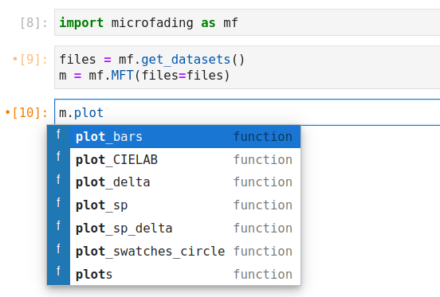

In this section, we will show you how to create visualizations of your microfading data. The plot functions, accessible after creating an instance of the microfading class, start with the verb "plot", as illustrated below. There are in total seven plots which are briefly described in Table 1. 

{: .img-medium align=left }
/// caption
The plot functions
///

Table 1. Description of the *plot* functions.

| 
Function name
 | 
Description

| :--------| :---------
|`plot_bars()` | plot the value of a single colorimetric coordinates at a given light dose
|`plot_CIELAB()`  | plot the trajectory of the $L^*a^*b^*$ coordinates in the CIELAB colour space
|`plot_delta()`  | plot the $\Delta$ curves for one or several CIE colour coordinates
|`plot_sp()` | plot the reflectance spectra
|`plot_sp_delta()` | plot the difference between two reflectance spectra
|`plot_swatches_cirlce()` | plot the colour changes as a series of coloured circles
|`plots()` | 

## **Plot parameters**

Most of the plot functions have the same parameters. Knowing how to use the parameters will allow you to adapt the plots according to your needs. You will find below a description and some information about a few plotting parameters.

- *colours* : allow you to modify the colour of the lines or points. You can enter the following types of input values:

	<ul class="a">
	  <li>String: it can be any colour compatible with the matplotlib colour list. In that case, all the lines or points have the same colour.
	  
	  eg: "green", "midnightblue", etc.</li>  	  
	  
	  <li>List of string: If you want to attribute a specific color to each curve or point. The amount of string elements in the list should therefore before equal to the amount of curves.
	  
	  eg: ["blue", "chartreuse"]</li> 
	  
	  <li>'sample': This will render each curve or point according to the colour of the corresponding sample. It takes the first reflectance spectrum of the microfading data and compute the sRGB values.</li> 
	  
	  <li>Float: a float between 0 and 1 will give a grey line ranging from black (0) to white (1).</li> 
	</ul>
	
&nbsp;

- *dose_unit* :

## **Save plots**

If you want to save the plot as an image file, then set the *save* parameter to True. I also recommend to enter a value for the *path_fig* parameter, otherwise it will save the figure in the current working directory with a very basic name. 

