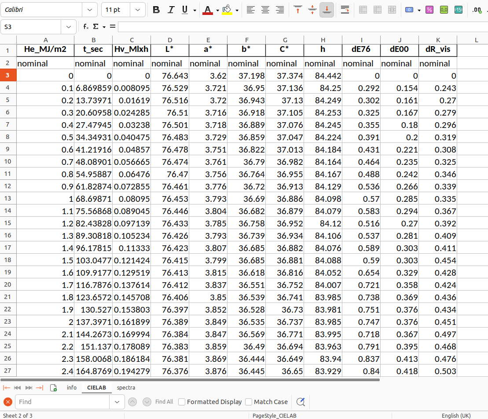

The `microfading` package aims to facilitate the manipulation of microfading data. Consequently, the microfading data files play a central role in the package. Like in most analytical techniques, several microfading devices have been developed over the years. Each device creates its own specfic rawfiles that are usually very different from one device to another. To compare the results obtained with different devices, one solution is to convert each rawfile into a unique file format, which is the method that has been chosen in this package. 

This unique file format, called *interim* file, is simply an Excel or an OpenDocument file with a specific inner structure to organize the data. Each *interim* file is composed of three sheets:

1. **info** : it contains the metadata related to the measurements, the object, and the project
2. **CIELAB** : it contains the colorimetric values
3. **spectra** : it contains the spectral values

An example of an *interim* file can be found in the microfading package [(get_datasets() function)](https://g-patin.github.io/microfading/retrieve-test-datasets/). As an illustration of the content of *interim* files, the picture below shows the CIELAB sheet of an *interim* file. The first three rows on the left are related to the light dose energy, while the other columns show various colorimetric units.

{: .img-large align=left }
/// caption
CIELAB sheet of a microfading interim file.
///

If you prefer to use the functionalities provided by Excel or OpenDocument, you can always create a new sheet inside an *interim* file to perform more calculations or create figures. I would not recommend to delete the existing columns or rows inside the first three sheets (info, CIELAB, spectra), or to create figures inside them. This might lead to some issues with the functions of the `microfading` package, and thus preventing its use.

Our conception of the structure related to scientific data and files can be viewed as a tree or an hourglass shape. At the bottom, there are multiple roots. Each root can be viewed as a device that produces its own raw files with a specific structure inside the files. It is very common in laboratory, to have different devices that are doing similar analyses. Comparing the data from these various raw files can be quite tidious. This is the reason why, the first step of our package is to convert raw files into *interim* files, so that whatever the microfading device you used to perform your analyses, the *interim* file will always have a similar structure. This is what makes the `microfading` functional because it expects a given structure that makes it easy to retrieve data or perform further computational processes. Above the *interim* files are the *processed* files. Their structure can be different and be specific according to the projects, the research questions, etc. This is where data and files gain in flexibility so that it can adequately fullfill the needs and objectives of each project.

---

© 2026 Gauthier Patin. All rights reserved. | Last updated: 2026-01-05

