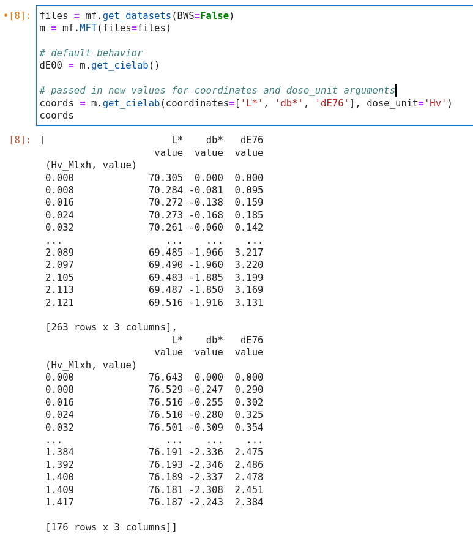

In this section, we will give you all the essential information to correctly start using the `microfading` package.

1. **Do you have microfading data files?**

	The whole package is based on microfading data files that you either obtained yourself when performing microfading measurements or obtained from someone else. They consists of excel files with a specific structure organizing the data inside the files. Check the [datafiles section](https://g-patin.github.io/microfading/datafiles/) for more information about it. 
	
	If you don't have any microfading files, the package has a function to load microfading files, so that you can use these files to play with the functionalities of the package (see [get_datasets](https://g-patin.github.io/microfading/get_datasets/) section).  
	
	If you have files, the following lines of code shows how you can import them in the jupyter notebook:
	&nbsp;

	```python
	# I use this package to select files on my local computer
	from glob import glob 
	```

	```python
	# I use the command 'cd <path>' to change directly and be in the folder where the microfading files are.
	```	

	```python	
	cd /home/username/Documents/MFT
	```


	```python
	# Using the glob method, I select the files that contain the words 'BW1' and 'MFT' in the filename.
	files = sorted(glob('*BW1*MFT*'))
	files
	```

	<div class="output-area">
	<pre>[PosixPath('/home/username/Documents/MFT/2024-144_MF.BWS002.G01_avg_BW1_model_2024-07-30_MFT2.xlsx'),
	PosixPath('/home/username/Documents/MFT/2024-144_MF.BWS003.G01_avg_BW1_model_2024-08-02_MFT2.xlsx')]
	</pre>
	</div>
	&nbsp;


2. **Central role of the `MFT` class**

	Once you have selected microfading files and encapsulated them inside a python list, you will need to create an instance of the `MFT` class passing the variable for your microfading files as argument (see code below). All the functions provided by the package can only be accessed through the `MFT` class.  
	&nbsp;
	
	```python
	import microfading as mf
	```

	```python
	m = mf.MFT(files=files)
	```
	&nbsp;
		
	
3. **Three keywords function: get, plot, compute**

	Once you have created an instance of the `MFT` class, you can access the functions. The name of each function starts by a verb: get, plot, or compute. Enter one of these verbs and use the auto-completion tool (`Shift + Tab`) to display a list of available functions.

	{: .img-medium align=left }
	/// caption
	List of all the plotting functions.
	///
	
	The functions can be run without passing any arguments, this will output the default values. To adjust the output to your needs, you will need to modify the values of the arguments. For instance, the function `get_cielab()` returns the $\Delta E_{00}$ values by default. If you want to retrieve other CIELAB coordinates, you will need to pass in a new value for the argument *coordinates* (see code below). To know the role of each argument in a function and which values can you pass in, you will need to read the documentation. The latter can either be access in the jupyter notebook or in the [References section](https://g-patin.github.io/microfading/references/) of this website.
	
	{: .img-large align=left }
	/// caption
	Play with the argument values of functions 
	///


