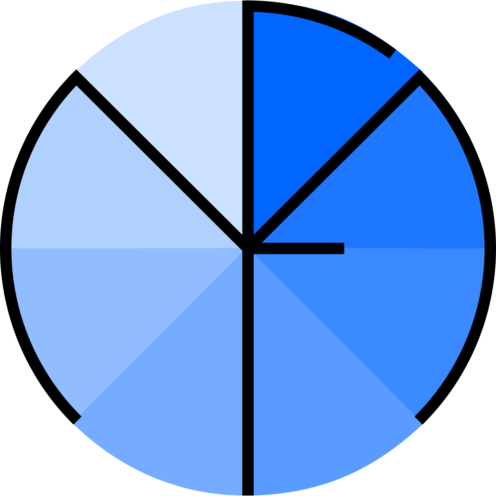

# Welcome !



Welcome on the documentation website of the microfading python package. The documentation follows the structure described by [Daniele Procida](https://diataxis.fr/), which organizes documentation into four different groups (Tutorials, How-to, Explanations, References).

This package has been created to help microfading users to manipulate their data. It provides a set of computational tools to ease data processing and visualizations. If you are a new user of the `microfading` package, I would recommend to use the test datasets [(get_datasets() function)](https://g-patin.github.io/microfading/retrieve-test-datasets/) so that you can start playing around with the various functions of the package. Afterwards, you can decide whether you want to use the packages with or without the databases.

## Installation

You can install the package with the following command:

```
pip install microfading
```

## Cite package

If you are using this package for a publication, please cite the package as follows: ......

## Contributions

We are welcoming any contributions that can improve the package. If you have encountered a bug or spotted an error, please don't hesitate to contact us. 

## Project layout

    mkdocs.yml    # The configuration file.
    docs/
        index.md  # The documentation homepage.
        ...       # Other markdown pages, images and other files.
