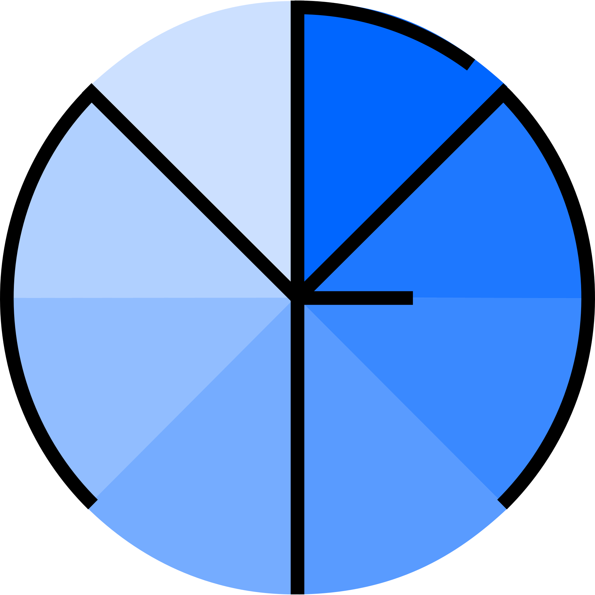

# Welcome !

Welcome on the documentation website of the microfading python package. The documentation has been organized around four different groups (Tutorials, How-to, Explanations, References) as explained by [Daniele Procida](https://diataxis.fr/).

If you are a new user of the `microfading` package, I would recommend to use the test datasets [(get_datasets() function)](https://g-patin.github.io/microfading/retrieve-test-datasets/) so that you can start playing around with the various functions of the package. Afterwards, you can decide whether you want to use the packages with or without the databases. If you just want to process and visualize a few microfading analyses then you might not need databases. But if you are seeking to establish a long-term microfading framework where you want to connect information about the objects with microfading analyses, then you  might be interested in using databases.

## Commands

* `mkdocs new [dir-name]` - Create a new project.
* `mkdocs serve` - Start the live-reloading docs server.
* `mkdocs build` - Build the documentation site.
* `mkdocs -h` - Print help message and exit.

## Project layout

    mkdocs.yml    # The configuration file.
    docs/
        index.md  # The documentation homepage.
        ...       # Other markdown pages, images and other files.
