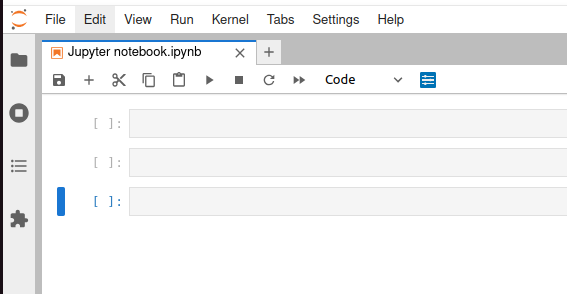
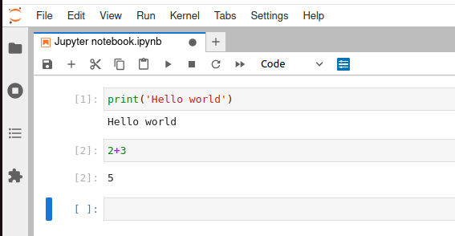
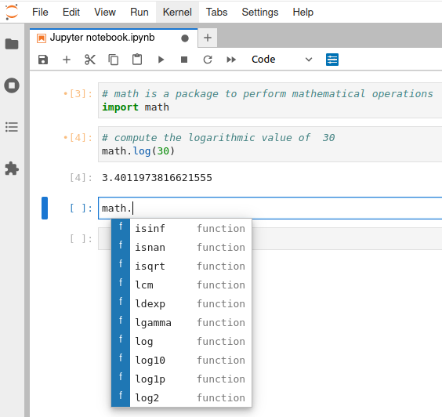

In the field of heritage science, the most common way to manipulate numerical data involves the use of spreadsheet environment such as Excel or Libre Office. In most cases, it is a perfect solution fullfilling the needs of the users. However, the use of spreadsheets for manipulating microfading data can quickly lead to several challenges and limitations:

- The first limitation dealt with the scalability. While a spreadsheet can easily handle small datasets, it becomes more difficult when the amount and complexity of the data significantly increase. 
- Another issue is about task automation, which is hardly possible with a spreadsheet, where the file measurements can only be processed individually. One can have a template spreadsheet that can be re-use, but every time the raw data will need to be copied and pasted into the spreadsheet. 
- Complex calculations can be quite cumbersome to perform with spreadsheet software. For example, difficulty in computing the CIEDE2000 equation forces some users to keep using the $L^*a^*b^*$ CIE 1976 equation which is less accurate than recent equations.
- The visualization provided by most spreasheet software is often of low quality. Complex figures or imaged-related visualizations complying with the recommendations provided by Edward Tufte is hardly possible in Excel or Libre Office. The ability to visualize our microfading data in a very intuitive way is a crucial aspect for us.
- Difficulty of doing version control with spreadsheets. The possibility to build a tool that you can improve over time and keep tracks of changes is a fundamental aspects of research and science. 

In the data science field, the use of [Python](https://www.python.org/) and [Jupyter notebooks](https://jupyter.org/) has become very popular. It can handle large amount of data and can easily perform version control and automation. There are a huge diversity of Python libraries, allowing users to perform completely different tasks while staying in the same environment. For example, a spreadsheet can easily handle numerical data, but is not very adequate for images. Inside a Jupyter notebook, I can process numerical data, then create visualizations, and apply the outcomes to create a digital reconstruction of the object. An evolution of heritage science practices over the last few decades is the importance of image-based data, and the ability to convert numerical data into images that are more easy and intuitive to understand and relate to actual objects, such as works of art.   

A Jupyter notebook works with interactive cells aligned on top of each other (See figure below). The interactivity of each cell implies a system of input / output values. More precisely, we write inputs inside the cell (a simple text or python code), then we activate the cell (by pressing the play button or pressing `Shift + Enter`), and it returns an output value. In the example below, I simply asked to print the expresssion "Hello world" in the first cell and to perform an addition in the second cell.

{: .img-medium align=left }
/// caption
A Jupyter notebook with three empty cells.
///

{: .img-medium align=left }
/// caption
A simple print statement.
///

Now think of a notebook as a very basic car. The most basic functionalities of such a car would simply be to move forward, backward, and to stop. A basic on its own also provide basic operators, like print statement or simple mathematical operations. In your car, you might want to listen to radio or have a navigation system. A skilled electrician could build a radio from scratch and customize it for the car, but most of us would directly buy a radio made by someone else and simply connect it to our car. The same concept apply in Jupyter notebooks. To increase the things we can do inside notebooks, we will import software (called "package") made by others. For example, in the figure below, I imported the *math* package in the first cell (activation cells of import statements usally does not produce an output). Then, in the second cell, I used the *log* function of the *math* package. If you start by typing *math.* and then press `Tab`, a window will appear with all the available functions inside the package. I could have written myself the python code to compute logarithmic values, but it would have taken me much more time, and I could have made errors during the writing process. 

{: .img-medium align=left }
/// caption
Import a package to compute logarithmic values.
///

This is a very short introduction about Jupyter notebooks. There are much more to say about it, but you will be able to find online many useful tutorials about it. Welcome and goodluck !
