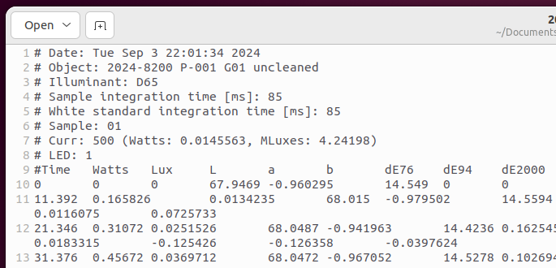

The language setting is only necessary when processing the microfading raw files using the `process_rawdata()` function. Selecting the adequate language setting enables the algorithm to correctly parse the datetime information given in the raw files. By default, the algorithm assumes that English was used for the language setting of the computer. If this is not the case, you will need to select another language setting, which will slightly different whether you work on Windows OS or Linux OS.

**Windows OS**

If you used a Windows OS computer to perform the analyses, you can use one the following language abbreviations that corresponds to your computer language (non-exhaustive list) : 'en', 'fr', 'it', 'nl', 'de', 'es'.

**Linux OS**

If you used a Linux OS computer to perform the analyses, you cannot simply type the abbreviations of the language, like for Windows OS. You will need to retrieve the correct language setting. For that, open a terminal, and type the command *locale -a*

# Fotonowy raw files

When you open the .txt file (the one containing the CIE colorimetric values) provided by Fotonowy, the first line provides information about the date and time of the analysis (see image below). The software of Fotonowy directly retrieve this information from the computer that was used to perform the analysis. According to the language configuration of the computer, the date and time will be formated differently. Therefore, when the algorithm of the `microfading` package read this file and try to parse the date and time information, it will need to know the language settings, so that it can adequately determine the information 

{: .img-large align=left }
/// caption
Details of a microfading Fotonowy raw files
///

For the curious people, you can open the process_rawfiles.py inside the microfading package and search for the expression "analysis datetime". It will show you where and how the language setting is used. You will see that it is used inside a function called "parse_datetime" which is written at the beginning of the process_rawfiles.py file.

